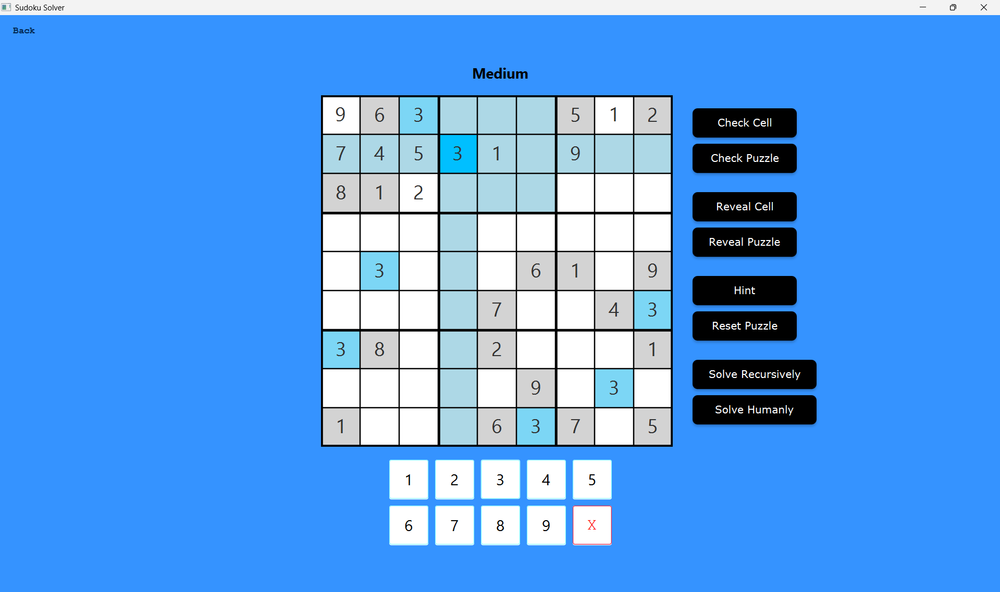
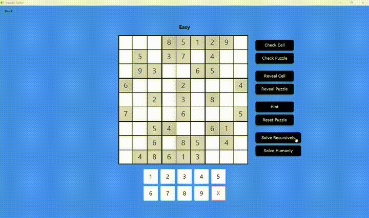
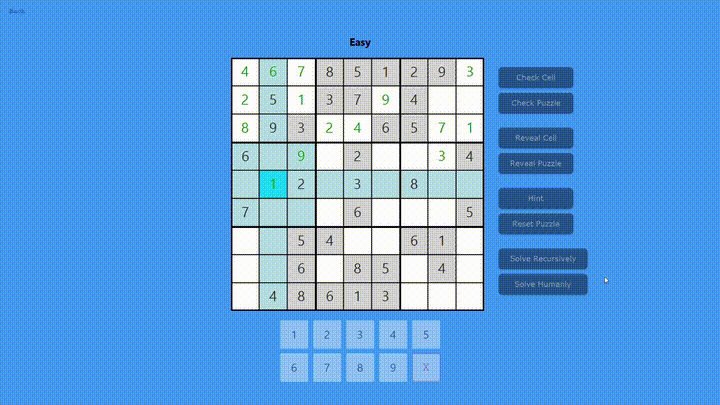
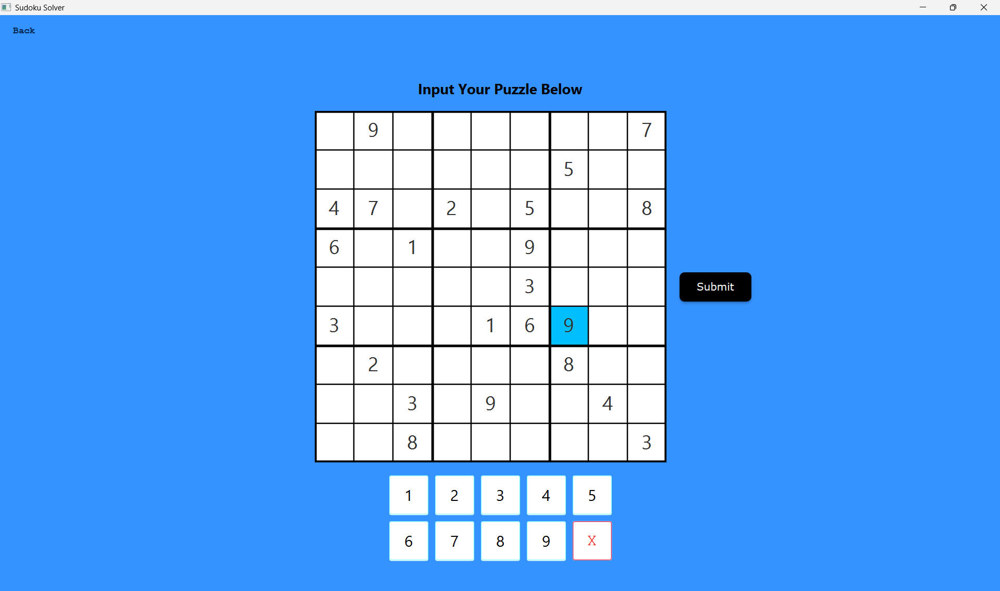
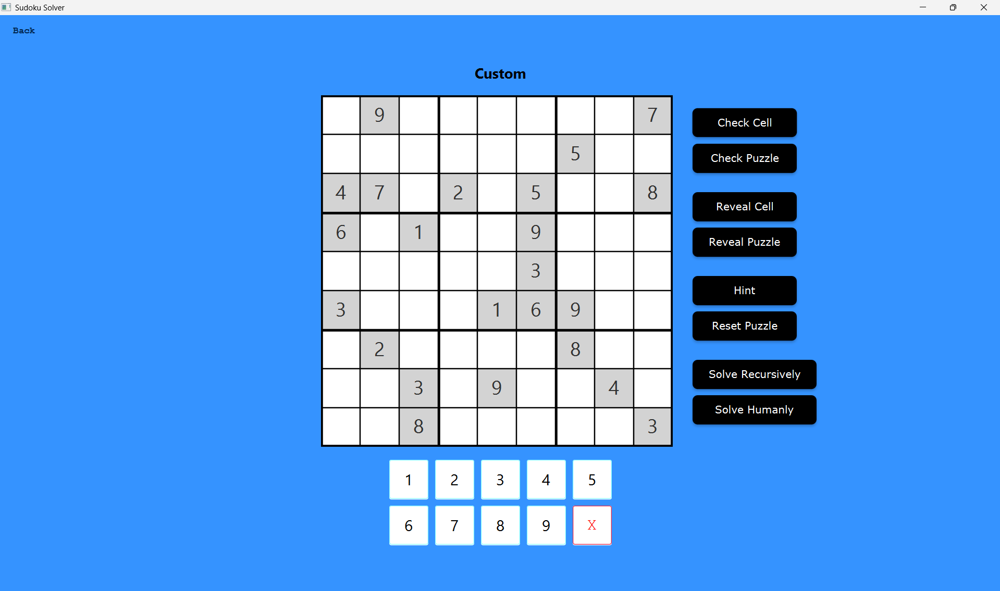
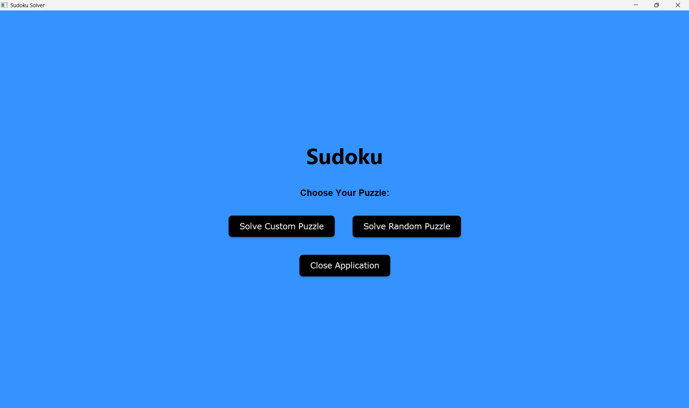
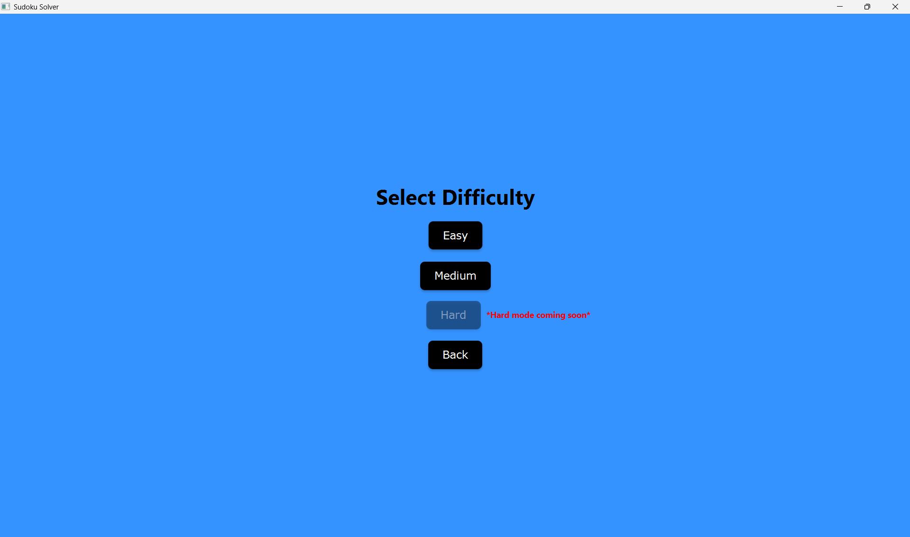
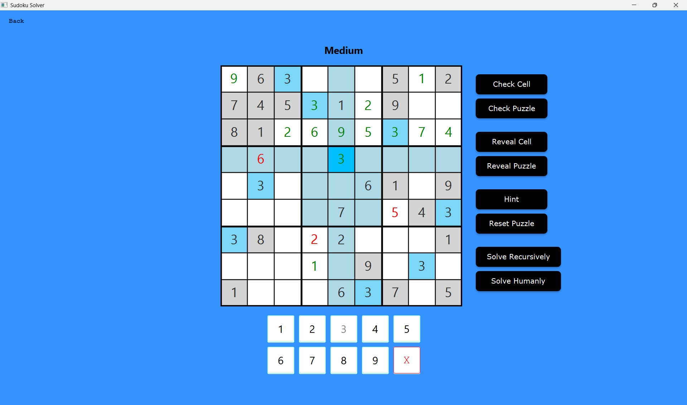
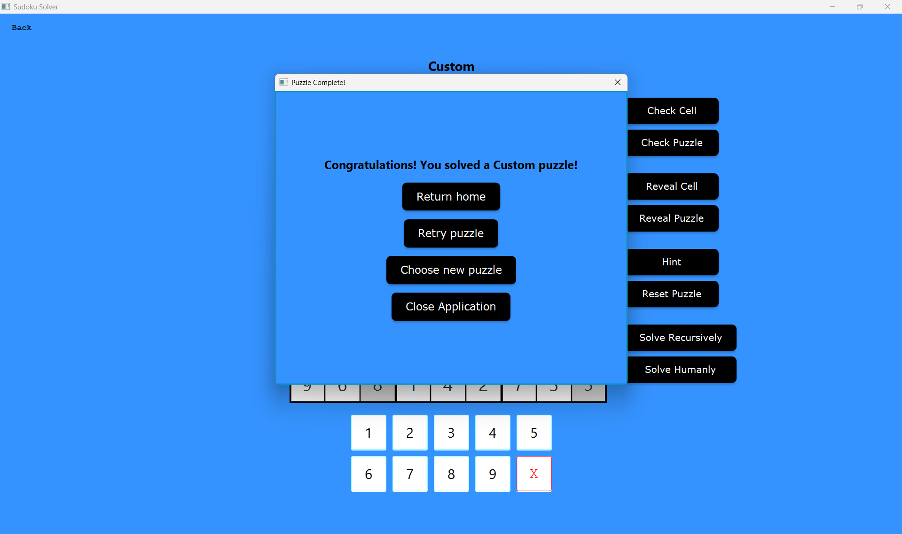

# Sudoku Solver

**A desktop Sudoku app that doesn't just let you play, but also solves puzzles recursively as well as the way a human would, using real solving techniques step by step, live, in front of you.**



## What This Is

Most Sudoku solvers brute-force their way to an answer instantly, giving you a finished board with no insight into *how* it got there. This one is different: alongside a recursive solving system, it also implements an actual cascade of human Sudoku-solving techniques, including naked singles, hidden singles, pointing pairs, and naked pairs/triples/quads, and can walk through a puzzle one logical deduction at a time, so you can actually learn the techniques instead of just seeing a solved grid appear.

It also generates its own original, symmetric, difficulty-validated puzzles, lets you input and solve your own custom puzzles, and offers two distinct ways to watch it solve: a brute-force recursive backtracker, and the human-technique solver, both animated live.

## Features

- **Two ways to play** — generate a random puzzle at a chosen difficulty, or input your own custom puzzle
- **Custom puzzle validation** — submitted puzzles are checked for correctness and confirmed to have exactly one valid solution before you're allowed to solve them
- **Live-solving animations** — watch the app solve in real time using either method, with a 1-second pace on the human solver so each deduction is visible
- **Interactive solving tools** — check a single cell or the whole puzzle, reveal a cell or the entire board, reset and start over, or request a hint that highlights the next logically solvable cell
- **Smart highlighting** — selecting a cell highlights its row, column, 3×3 box, and any matching numbers elsewhere on the board
- **Number pad with auto-disable** — once a digit has been placed 9 times, it greys out on the number pad

## How It Solves

The app offers two completely different solving strategies, and you can watch either one work in real time.

**Recursive (brute-force) solver:** This is a classic backtracking algorithm. It tries numbers 1–9 in each empty cell from top-left to bottom-right; the first valid number stays, and the algorithm moves to the next cell. When it hits a dead end, it backtracks and tries the next possibility. It's not fast in the way a human is "smart," but it's exhaustive and guaranteed to find a solution if one exists.

**Human-technique solver:** This approach mimics actual human reasoning. It works through a cascade of increasingly advanced techniques (starting with the simplest deduction and only escalating when simpler logic runs out of moves), filling in cells the same way an experienced Sudoku player would. The same difficulty cascade that solves puzzles is also what defines how puzzles are generated, described below.

| Recursive Solver | Human-Style Solver                                     |
|---|--------------------------------------------------------|
|  |  |

## How It Generates Puzzles

New puzzles aren't just randomly punched full of holes. The generator first builds a complete, randomized, valid solved board, then removes cells in symmetric pairs (rotational or reflective symmetry, chosen randomly per puzzle) to give every puzzle a clean, deliberate visual pattern rather than a scattershot appearance.

After every pair of cells is removed, the puzzle is immediately re-validated on two fronts: it must still have **exactly one solution**, and it must still be **solvable using only the techniques allowed at the target difficulty**. If removing a cell would force the puzzle to require a technique beyond its difficulty tier, that removal is undone and a different cell is tried instead. This means difficulty isn't just an arbitrary cell count. For example, a puzzle is "Easy" because the easy-tier solving cascade can fully solve it.

*Hard difficulty is currently disabled in the app while its symmetry patterns are still in development. Easy and Medium difficulties are both fully implemented and validated.*

## Custom Puzzle Input

Don't want a generated puzzle? Build your own. Click cells and enter values manually; on submission, the puzzle is checked for rule violations and confirmed to have a unique solution before you're sent to the solving screen.

| Building a Custom Puzzle | After Submission |
|---|---|
|  |  |

## Walkthrough

|                                                       | |
|-------------------------------------------------------|---|
|                 |  |
| **Home**                                              | **Difficulty Selection** |
|  |  |
| **Solving Screen**                                    | **Completion** |


## Architecture

The project was built in Java with JavaFX, cleanly split into two packages:

```
sudoku/
├── logic/    # Board state, solving algorithms, puzzle generation, candidate management
└── ui/       # JavaFX screens: home, difficulty select, custom input, solving, completion
```

The UI layer never implements solving logic directly. Every screen calls into `sudoku.logic` for board validation, solving, and generation, keeping presentation and logic fully decoupled.

## How to Run

**Windows only.**

1. Download `SudokuAppFinal.zip` from the [latest release](https://github.com/Chris83848/Sudoku-Solver/releases/latest).
2. Locate the downloaded zip (likely in your Downloads folder) and extract it fully. Right-click the file and choose **Extract All**, then follow the prompts.
3. Open the extracted folder.
4. Double-click `SudokuApp.exe` to launch the app.

The app must be run from inside its extracted folder because it depends on supporting files bundled alongside the `.exe` and will not launch correctly if moved out on its own.

If Windows shows a warning about running an app from an unknown publisher, click **More info**, then **Run anyway**. This is expected for unsigned indie applications and does not indicate a problem with the app itself.

## Known Limitations

- **Hard difficulty** is scaffolded but not yet implemented in the puzzle generator. The option is visibly disabled in the app rather than hidden.
- **The naked pairs technique has a known bug:** candidate cell coordinates are compared using `.equals()` on `int[]` arrays, which Java doesn't override for arrays and which therefore falls back to reference equality. As a result, naked pairs likely never actually fires during solving. This was discovered during a documentation pass and intentionally left unfixed, since the project is built and packaged via `jpackage` into a distributed `.exe`, and a source fix would require fully repackaging the release. The solver still functions correctly overall since naked triples and the other techniques in the cascade pick up the slack in practice.

## Author

**Christopher Harris** — [GitHub](https://github.com/Chris83848) · [LinkedIn](https://www.linkedin.com/in/christopher-harris9/)
